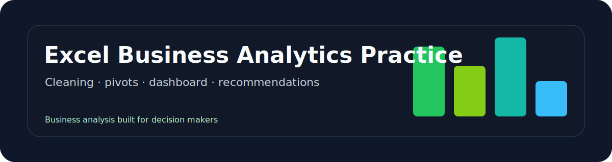
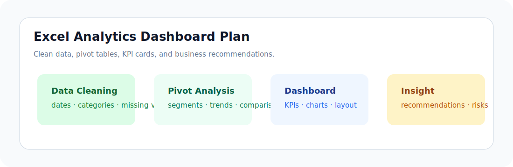

<p align="center">
  
</p>

<p align="center">
  
  
  
</p>

# Excel Business Analytics Practice

A business analytics practice repository covering data cleaning, pivot tables, charts, dashboard design, and business recommendations in Excel.

## At a Glance

| Item | Detail |
| --- | --- |
| Role fit | Data analyst intern, business analyst intern |
| Core value | Shows the practical Excel workflow recruiters still expect |
| Main skills | Data cleaning, pivot analysis, KPI dashboard design, recommendations |
| Recruiter signal | Can turn raw business data into clear decisions |

## Workflow Preview

<p align="center">
  
</p>

## Project Background

Excel remains one of the most common tools for business analysis. This project packages Excel analytics practice into a recruiter-readable repository that shows analytical process, dashboard thinking, and business interpretation.

## Problem I Solved

Raw business data is often messy and difficult to interpret. This project demonstrates how to structure a small analysis workflow from cleaning to insight delivery.

## Tools & Tech Stack

- Microsoft Excel.
- Pivot tables and charts.
- Basic formulas and data validation.
- Dashboard layout and business storytelling.

## Core Features

- Data cleaning checklist.
- Pivot table analysis plan.
- KPI dashboard outline.
- Business insight report template.
- Screenshot-ready dashboard structure.

## Project Highlights

- Focuses on clear business questions before charts.
- Explains what each KPI means and what decision it supports.
- Uses a simple structure that can be reused for sales, operations, or marketing datasets.

## Data / AI / Product Thinking

- Data analytics: cleaning, aggregation, KPI design, visualization.
- Product thinking: dashboard designed for decision makers, not only analysts.
- AI workflow: AI can help generate analysis questions and summarize insights, but final numbers must be checked manually.

## Outcome

This project provides an Excel analytics template suitable for internship applications and business case discussions.

## Repository Structure

```text
excel-business-analytics-practice/
├── README.md
├── data/
├── dashboard/
├── reports/
│   └── business-insights.md
├── assets/
└── docs/
    └── analysis-checklist.md
```

## Resume Bullet

- Built an Excel business analytics practice project covering data cleaning, pivot-table analysis, KPI dashboard design, and business recommendation writing.

## Next Improvements

- Add a downloadable sample Excel workbook.
- Add dashboard screenshots and KPI cards.
- Add a short business insight report with recommendations.

## Contact

For questions or collaboration: [steventang30999@gmail.com](mailto:steventang30999@gmail.com)
